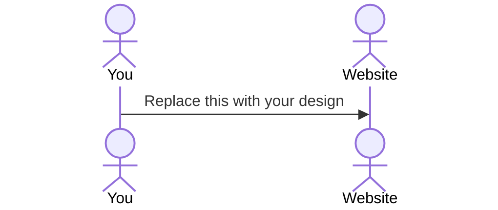

# Catnip Messaging

[My Notes](notes.md)

CatNip Messaging is a cat-themed chat platform for feline fans. There is real-time messaging, fun "paw-up" reactions, cat facts, and gifs, all with a cozy, cat-inspired design. It also includes secure login, personalized avatars, and a community vibe, it's more than a chat app—it's a haven for cat enthusiasts!

## 🚀 Specification Deliverable

- [X] Proper use of Markdown
- [X] A concise and compelling elevator pitch
- [X] Description of key features
- [X] Description of how you will use each technology
- [X] One or more rough sketches of your application. Images must be embedded in this file using Markdown image references.

### Elevator pitch

CatNip Messaging! It's a playful and cat-themed messaging platform for all the feline fans out there.
It is built with a focus on simplicity and usability. Users log in to discover new facts or see funny gifs from The Cat API.
Users are able to chat in real time using WebSocket technology and can even react to other messages with a "paw-up" or "paw-down" feature.
The main design includes warm cat inspired colors, a cursor that is a paw, and buttons that "purr" when hovered over. 
This brings back the joy to messaging and makes chatting with friends immersive and fun.
It also has secure authentication, personalized cat avatars, and a database that tracks the most liked messages.
CatNip Messaging isn't just another chat app, it is a community for cat lovers!

### Design

CatNip Messaging has a Slack-inspired design with a sidebar on the left for navigation, displaying chat rooms, user lists, and settings, with a cat-themed logo. The main area displays messages against and has a cat themed background with custom graphics. It also includes a display to show random cat facts. At the bottom, a long text box lets users type messages, attach files or photos, and use emojis, all with cat-themed icons. In addition there are warm, natural tones and animations create a fun look!

### Key features

- Login Feature
    - users are shown a random cat fact, or funny cat gif after entering user name and password.
- Real-Time Messaging
    - you can chat with others in real time using WebSocket Technology
    - "Cat Typing..." indicator shows that someone is typing
- Special reactions
    - "paw-up" or "paw-down" emojis.
- Authentication
    - regiser users and login with a special cat avatar.
    - store data in a private database.
- Fun Easter Eggs
    - Typing "meow" triggers a special animation.
- Dynamic view
    - Using react, there is a login form, chat window, and online user list. 
- Cat API
    - shows random at images and facts for user retention. 
- Community Building
    - This is desinged to create an enjoyable space that people that like cats can connect.
- Data Insights
    - tracks most liked messages to follow current trends in the community. 

### Technologies

I am going to use the required technologies in the following ways.

- **HTML** 
    - Two main pages
    - Login Page
    - Messagin Page
    - Hyperlink to reset password. 
- **CSS** 
    - incorporate cat themes throughout
    - Buttons that “purr” (vibrate) on hover. 
    - Cursor is a paw icon. 
    - Cat inspired colors, warm tones, furr colors. 
- **React** 
    - different views like login form, chat window, and online user list. 
    - use state hooks and other features to track user interactivity. 
    - use The Cat API to get cat images, and random facts. Message API will add messages to the database and then show them to different users. 
- **Service** 
   - Allow users to message eachother in real time, share images, files, and videos. 
   - connect with other community members. 
- **DB/Login** 
    - register and login users, store their information in a database. Have to login to start chatting.
    - Safely stores the user login information like cat avatar, username, password etc. 
    - Track reactions to most “paw-up” message and “paw-down” 
- **WebSocket** 
    - Show real-time communication. 
    - Users react with the paw-up/paw-down, real time typing like “Cat Typing…”

## 🚀 AWS deliverable

For this deliverable I did the following. I checked the box `[x]` and added a description for things I completed.

- [X] **Server deployed and accessible with custom domain name** - [My server link](https://catnipmessaging.click).

## 🚀 HTML deliverable

For this deliverable I did the following. I checked the box `[x]` and added a description for things I completed.

- [X] **HTML pages** - I did not complete this part of the deliverable.
- [X] **Proper HTML element usage** - I did not complete this part of the deliverable.
- [X] **Links** - I did not complete this part of the deliverable.
- [X] **Text** - I did not complete this part of the deliverable.
- [X] **3rd party API placeholder** - I did not complete this part of the deliverable.
- [X] **Images** - I did not complete this part of the deliverable.
- [X] **Login placeholder** - I did not complete this part of the deliverable.
- [X] **DB data placeholder** - I did not complete this part of the deliverable.
- [X] **WebSocket placeholder** - I did not complete this part of the deliverable.

## 🚀 CSS deliverable

For this deliverable I did the following. I checked the box `[x]` and added a description for things I completed.

- [ ] **Header, footer, and main content body** - I did not complete this part of the deliverable.
- [ ] **Navigation elements** - I did not complete this part of the deliverable.
- [ ] **Responsive to window resizing** - I did not complete this part of the deliverable.
- [ ] **Application elements** - I did not complete this part of the deliverable.
- [ ] **Application text content** - I did not complete this part of the deliverable.
- [ ] **Application images** - I did not complete this part of the deliverable.

## 🚀 React part 1: Routing deliverable

For this deliverable I did the following. I checked the box `[x]` and added a description for things I completed.

- [ ] **Bundled using Vite** - I did not complete this part of the deliverable.
- [ ] **Components** - I did not complete this part of the deliverable.
- [ ] **Router** - Routing between login and voting components.

## 🚀 React part 2: Reactivity

For this deliverable I did the following. I checked the box `[x]` and added a description for things I completed.

- [ ] **All functionality implemented or mocked out** - I did not complete this part of the deliverable.
- [ ] **Hooks** - I did not complete this part of the deliverable.

## 🚀 Service deliverable

For this deliverable I did the following. I checked the box `[x]` and added a description for things I completed.

- [ ] **Node.js/Express HTTP service** - I did not complete this part of the deliverable.
- [ ] **Static middleware for frontend** - I did not complete this part of the deliverable.
- [ ] **Calls to third party endpoints** - I did not complete this part of the deliverable.
- [ ] **Backend service endpoints** - I did not complete this part of the deliverable.
- [ ] **Frontend calls service endpoints** - I did not complete this part of the deliverable.

## 🚀 DB/Login deliverable

For this deliverable I did the following. I checked the box `[x]` and added a description for things I completed.

- [ ] **User registration** - I did not complete this part of the deliverable.
- [ ] **User login and logout** - I did not complete this part of the deliverable.
- [ ] **Stores data in MongoDB** - I did not complete this part of the deliverable.
- [ ] **Stores credentials in MongoDB** - I did not complete this part of the deliverable.
- [ ] **Restricts functionality based on authentication** - I did not complete this part of the deliverable.

## 🚀 WebSocket deliverable

For this deliverable I did the following. I checked the box `[x]` and added a description for things I completed.

- [ ] **Backend listens for WebSocket connection** - I did not complete this part of the deliverable.
- [ ] **Frontend makes WebSocket connection** - I did not complete this part of the deliverable.
- [ ] **Data sent over WebSocket connection** - I did not complete this part of the deliverable.
- [ ] **WebSocket data displayed** - I did not complete this part of the deliverable.
- [ ] **Application is fully functional** - I did not complete this part of the deliverable.
