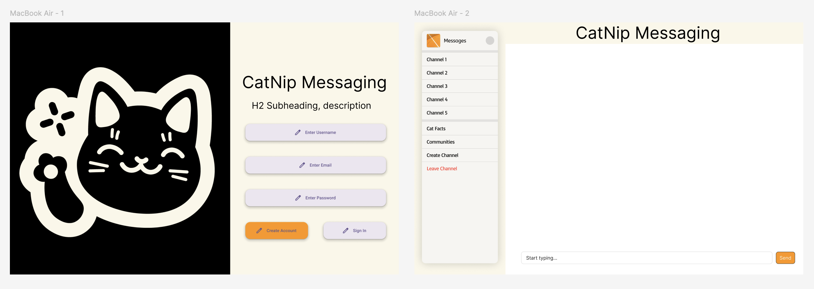
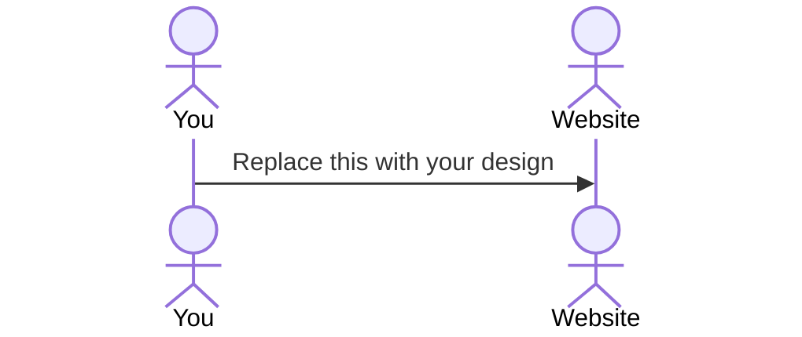

# Catnip Messaging

[My Notes](notes.md)

CatNip Messaging is a cat-themed chat platform for feline fans. There is real-time messaging, fun "paw-up" reactions, cat facts, and gifs, all with a cozy, cat-inspired design. It also includes secure login, personalized avatars, and a community vibe, it's more than a chat app—it's a haven for cat enthusiasts!

## 🚀 Specification Deliverable

- [X] Proper use of Markdown
- [X] A concise and compelling elevator pitch
- [X] Description of key features
- [X] Description of how you will use each technology
- [X] One or more rough sketches of your application. Images must be embedded in this file using Markdown image references.

### Elevator pitch

CatNip Messaging! It's a playful and cat-themed messaging platform for all the feline fans out there.
It is built with a focus on simplicity and usability. Users log in to discover new facts or see funny gifs from The Cat API.
Users are able to chat in real time using WebSocket technology and can even react to other messages with a "paw-up" or "paw-down" feature.
The main design includes warm cat inspired colors, a cursor that is a paw, and buttons that "purr" when hovered over. 
This brings back the joy to messaging and makes chatting with friends immersive and fun.
It also has secure authentication, personalized cat avatars, and a database that tracks the most liked messages.
CatNip Messaging isn't just another chat app, it is a community for cat lovers!

### Design

CatNip Messaging has a Slack-inspired design with a sidebar on the left for navigation, displaying chat rooms, user lists, and settings, with a cat-themed logo. The main area displays messages against and has a cat themed background with custom graphics. It also includes a display to show random cat facts. At the bottom, a long text box lets users type messages, attach files or photos, and use emojis, all with cat-themed icons. In addition there are warm, natural tones and animations create a fun look!

### Key features

- Login Feature
    - users are shown a random cat fact, or funny cat gif after entering user name and password.
- Real-Time Messaging
    - you can chat with others in real time using WebSocket Technology
    - "Cat Typing..." indicator shows that someone is typing
- Special reactions
    - "paw-up" or "paw-down" emojis.
- Authentication
    - regiser users and login with a special cat avatar.
    - store data in a private database.
- Fun Easter Eggs
    - Typing "meow" triggers a special animation.
- Dynamic view
    - Using react, there is a login form, chat window, and online user list. 
- Cat API
    - shows random at images and facts for user retention. 
- Community Building
    - This is desinged to create an enjoyable space that people that like cats can connect.
- Data Insights
    - tracks most liked messages to follow current trends in the community. 

### Technologies

I am going to use the required technologies in the following ways.

- **HTML** 
    - Two main pages
    - Login Page
    - Messagin Page
    - Hyperlink to reset password. 
- **CSS** 
    - incorporate cat themes throughout
    - Buttons that “purr” (vibrate) on hover. 
    - Cursor is a paw icon. 
    - Cat inspired colors, warm tones, furr colors. 
- **React** 
    - different views like login form, chat window, and online user list. 
    - use state hooks and other features to track user interactivity. 
    - use The Cat API to get cat images, and random facts. Message API will add messages to the database and then show them to different users. 
- **Service** 
   - Allow users to message eachother in real time, share images, files, and videos. 
   - connect with other community members. 
- **DB/Login** 
    - register and login users, store their information in a database. Have to login to start chatting.
    - Safely stores the user login information like cat avatar, username, password etc. 
    - Track reactions to most “paw-up” message and “paw-down” 
- **WebSocket** 
    - Show real-time communication. 
    - Users react with the paw-up/paw-down, real time typing like “Cat Typing…”

## 🚀 AWS deliverable

For this deliverable I did the following. I checked the box `[x]` and added a description for things I completed.

- [X] **Server deployed and accessible with custom domain name** - [My server link](https://catnipmessaging.click).

## 🚀 HTML deliverable

For this deliverable I did the following. I checked the box `[x]` and added a description for things I completed.

- [X] **HTML pages** - Login, Messaging, Developer, Cat Fact pages. 
- [X] **Proper HTML element usage** - I used Headers, Nav, Footers, and Main throughout the different pages. 
- [X] **Links** - Added link to my Github at the login page.
- [X] **Text** - Added relevant text. 
- [X] **3rd party API placeholder** - This is found when you login, then navigate to the Cat Facts Channel. This is a placeholder.
- [X] **Images** - Main logo on the landing page .
- [X] **Login placeholder** - Input boxes for username and password. 
- [X] **DB data placeholder** - Navigate to the developer button at the bottom of the main page. 
- [X] **WebSocket placeholder** - After login, the main messaging box will eventually show real-time messages. 

## 🚀 CSS deliverable

For this deliverable I did the following. I checked the box `[x]` and added a description for things I completed.

- [X] **Header, footer, and main content body** - I added styles to the header, footer, and main content body. I wanted to make the header and footer sticky and the main content body to be the main content. I liked OpenAi's navbar and wanted to make something similar. 
- [X] **Navigation elements** - Using inspiration from other popular sites, I did a classic navbar at the top, that is sticky, with the logo on the far left. I chose a white color for easy visibilty. 
- [X] **Responsive to window resizing** - For this part, I made the navbar, message page, about page, and contact page all responsive to different screen sizes. This included removing images, resizing channel boxes, and other changes that I felt were necessary while mainting usability. 
- [X] **Application elements** - I added a text message box, channel navigation, login form, and other elements to the pages. 
- [X] **Application text content** - I implemented the text content for the landing page, about page, and contact page. 
- [X] **Application images** - I added images to the landing page, about page, and contact page. 

## 🚀 React part 1: Routing deliverable

For this deliverable I did the following. I checked the box `[x]` and added a description for things I completed.

- [X] **Bundled using Vite** - I bundled using Vite.
- [X] **Components** - I created components for the login and messaging page.
- [X] **Router** - I created a router for the login and messaging page.

## 🚀 React part 2: Reactivity

For this deliverable I did the following. I checked the box `[x]` and added a description for things I completed.

- [X] **All functionality implemented or mocked out** - Channels: I created a AddChannel component that implements useState and handleSubmit to allow a user to create a new channel to send messages in. I created a MessagesInput component to allow users to create and send custom messages in the specific chat using useState and handleSubmit. I also added functionality for login and registering a user, by adding it to localStorage. Also hooked up an API to get cat facts. I did the same thing with the contact page. It stores the form data in localStorage.
- [X] **Hooks** - I added  useEffect and useState hooks to the project to help with the messaging, login, and contact page.

## 🚀 Service deliverable

For this deliverable I did the following. I checked the box `[x]` and added a description for things I completed.

- [X] **Node.js/Express HTTP service** - Implemented an Express server with API routes.
- [X] **Static middleware for frontend** - Serving static files from public directory.
- [X] **Calls to third party endpoints** - Added Cat Facts API integration.
- [X] **Backend service endpoints** - Created endpoints for auth, channels, and messages.
- [X] **Frontend calls service endpoints** - Frontend interacts with backend via fetch calls.

## 🚀 DB/Login deliverable

For this deliverable I did the following. I checked the box `[x]` and added a description for things I completed.

- [X] **User registration** - Users can create a new account and their credentials will be stored in MongoDB. 
- [X] **User login and logout** - Users can login with a created account, and it will be stored in MongoDB.
- [X] **Stores data in MongoDB** - Messages, Channels, Forms, and Accounts are stored persistently in MongoDB.
- [X] **Stores credentials in MongoDB** - Credentials are stored in MongoDB.
- [X] **Restricts functionality based on authentication** - You are only given access to landing page, when not logged in. 

## 🚀 WebSocket deliverable

For this deliverable I did the following. I checked the box `[x]` and added a description for things I completed.

- [ ] **Backend listens for WebSocket connection** - I did not complete this part of the deliverable.
- [ ] **Frontend makes WebSocket connection** - I did not complete this part of the deliverable.
- [ ] **Data sent over WebSocket connection** - I did not complete this part of the deliverable.
- [ ] **WebSocket data displayed** - I did not complete this part of the deliverable.
- [ ] **Application is fully functional** - I did not complete this part of the deliverable.
